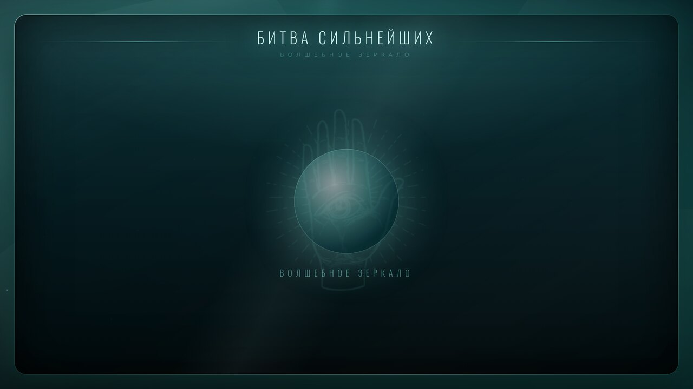
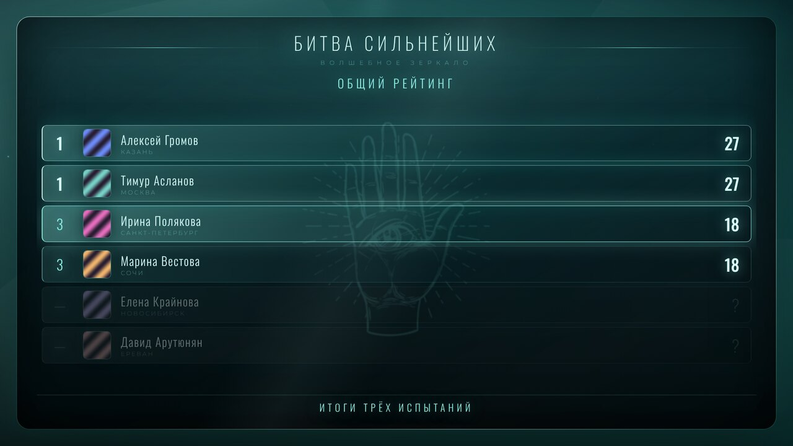
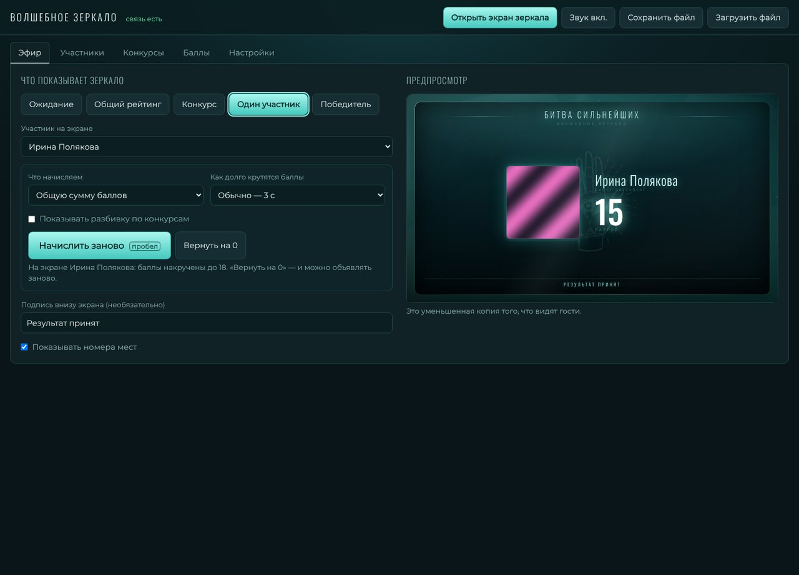
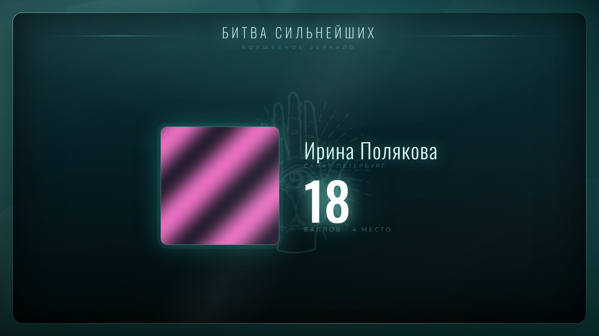

# Волшебное зеркало

Программа для шоу в духе «Битвы сильнейших»: на ноутбуке ведущий вводит участников,
их фото и баллы за конкурсы, а на телевизоре (подключённом по HDMI) гости видят
красивый экран рейтинга — с портретами, местами и эффектным открытием оценок.

Работает полностью офлайн, на одном ноутбуке. Интернет нужен только один раз —
чтобы установить Node.js.







## Что умеет

**Пульт на ноутбуке:**
- участники: имя, подпись (город/регалии), фото (файл или перетаскивание), пометка «выбыл»;
- конкурсы: сколько угодно, с переименованием и сортировкой;
- таблица баллов: участники × конкурсы, сумма считается сама;
- предпросмотр того, что сейчас на телевизоре;
- сохранение и загрузка всего шоу в файл.

**Экран зеркала (телевизор):**
- **Ожидание** — заставка с мерцающим шаром;
- **Общий рейтинг** — все участники по сумме баллов;
- **Конкурс** — результаты одного конкурса;
- **Один участник** — крупный портрет и счётчик баллов от нуля (см. ниже);
- **Победитель** — то же самое с короной;
- подпись внизу экрана (например, «Голосование жюри»);
- звук: щелчки счётчика, удар на финале, фанфары победителю.

**Открытие баллов.** Баллы можно внести заранее — на экране вместо них будет «?»,
а участники будут стоять внизу списка. Кнопка **«Открыть следующего»** (или пробел)
открывает очередного участника, начиная с последнего места: его оценка вспыхивает,
и строка плавно переезжает на своё место в рейтинге. Это и есть эффект «зеркала».

## Объявление результата

Отдельный режим для момента «называют участника и объявляют его баллы».
На экране остаётся только портрет слева и число справа — и по нажатию кнопки
(или пробела) баллы накручиваются от нуля до нужной цифры, замедляясь к финалу,
под щелчки счётчика и удар гонга на остановке. Когда счётчик замирает,
под числом появляется место участника.



Настраивается на вкладке **Эфир** → режим **«Один участник»**:
- **что начисляем** — общую сумму или баллы за конкретный конкурс;
- **как долго крутятся баллы** — от 1,5 до 8 секунд;
- **«Начислить баллы»** (или пробел) — запуск; **«Вернуть на 0»** — показать заново;
- разбивку по конкурсам можно включить галочкой, по умолчанию её нет —
  чтобы на экране ничего не отвлекало от портрета и цифры.

При переключении на другого участника счётчик сам возвращается к нулю,
так что случайно показать результат заранее не получится.

## Установка

1. Поставьте [Node.js](https://nodejs.org) (версия 18 или новее, подойдёт LTS).
2. Скачайте эту папку на ноутбук.
3. Запустите:
   - macOS — двойной клик по `start.command`;
   - Windows — двойной клик по `start.bat`;
   - или в терминале из папки проекта: `node server.js`.

В окне терминала появятся адреса. Терминал во время шоу закрывать нельзя.

## Подключение телевизора

1. Соедините ноутбук и телевизор кабелем HDMI.
2. В настройках экрана выберите **расширить рабочий стол** (не «дублировать»):
   - Windows: `Win + P` → «Расширить»;
   - macOS: Системные настройки → Мониторы → выключить «Включить видеоповтор».
3. Откройте в браузере `http://localhost:7777/admin.html` — это пульт.
4. Нажмите **«Открыть экран зеркала»**, перетащите новое окно на телевизор
   и нажмите в нём клавишу **F** (или F11) — окно развернётся во весь экран.
   Курсор на экране зеркала не виден.

Пульт остаётся на ноутбуке, зеркало — на телевизоре. Всё, что меняется на пульте,
появляется на телевизоре мгновенно.

### Звук

Звук идёт из окна зеркала, то есть через тот же HDMI на динамики телевизора.
Два условия:

1. В настройках звука ноутбука выберите устройство вывода — телевизор (HDMI).
2. Браузер не включает звук, пока в окне ничего не нажали. Нажмите в окне зеркала
   клавишу **F** (ту же, что разворачивает на весь экран) — звук разблокируется.
   Пока он заблокирован, внизу экрана висит подсказка.

Что звучит: щелчки при накрутке баллов (ускоряются и замедляются вместе с числом),
удар гонга в момент остановки, переливы при открытии оценок в рейтинге,
шорох при смене картинки и фанфары при объявлении победителя.
Громкость, выключатель и кнопка проверки — на вкладке **Настройки**,
быстрый выключатель звука — в верхней строке пульта.
Там же включается тихий гул зеркала в режиме ожидания.

Звуки не скачиваются и не лежат файлами — они синтезируются прямо в браузере,
поэтому программа остаётся офлайновой. Тембры правятся в `public/sound.js`.

### Пульт в телефоне или планшете

Если телефон в той же Wi-Fi-сети, откройте на нём адрес вида `http://192.168.x.x:7777/admin.html`
(точный адрес сервер печатает при запуске). Тогда ведущий может открывать баллы
прямо со сцены. Пультов может быть несколько, они синхронизируются.

## Как вести эфир

1. До шоу: вкладки **Участники** и **Конкурсы** — внесите всех и все испытания.
2. После каждого конкурса: вкладка **Баллы** — проставьте оценки (сохраняются сразу,
   на экране их пока не видно).
3. Вкладка **Эфир**:
   - объявляете одного участника — режим **«Один участник»**, затем «Начислить баллы»
     (баллы накрутятся от нуля);
   - показываете общую картину — режим **«Общий рейтинг»** или **«Конкурс»**
     и открывайте участников по одному кнопкой «Открыть следующего» или пробелом.
4. Финал: режим **Победитель** — крупный портрет с короной.

## Данные

Всё хранится на вашем ноутбуке:
- `data/state.json` — участники, конкурсы, баллы и состояние экрана;
- `data/photos/` — загруженные фотографии.

Состояние сохраняется автоматически, поэтому случайно закрытый терминал или
перезагрузка ноутбука ничего не теряют: запустите сервер снова — всё на месте.
Перед шоу полезно нажать **«Сохранить файл»** и положить резервную копию в надёжное место.

## Оформление

Стиль собран по заставкам «Битвы экстрасенсов»: бирюзовый туман, лучи,
кристальные осколки, знак ладони за содержимым и узкие прописные.

- Шрифты — **Oswald** (заголовки, имена, цифры) и **Montserrat** (подписи).
  Они лежат в `public/fonts/` и не скачиваются из интернета.
- Палитра задана переменными в начале `public/display.css`
  (`--aqua`, `--aqua-deep`, `--gold` для победителя). Поменяйте их — поменяется весь экран.
- Знак ладони — `public/hand.svg` (векторная обводка рисунка, белый фон убран,
  цвет линий `#8df0e6` задан прямо в файле). Размер, прозрачность и пульсацию
  правит правило `.hand` в `display.css`.
- Пульт собран в той же палитре, переменные в начале `public/admin.css`.

## Настройка

- Заголовок и подзаголовок экрана — вкладка **Настройки**.
- Порт по умолчанию 7777. Если он занят: `PORT=8080 node server.js`.
- Звуки — `public/sound.js`, каждый собран из нескольких генераторов, менять можно по одному.
- Оформление экрана целиком лежит в `public/display.css` — цвета, фон,
  шрифты и размеры можно менять там, не трогая логику.

## Проверка после правок

Если будете что-то менять в коде, есть автотесты: они поднимают сервер на отдельном порту
и гоняют в Chrome сначала пульт (участники, баллы, открытие оценок, начисление, звук),
потом сам экран зеркала (счётчик, щелчки, посадка списка по высоте).

```
npm test
```

## Если что-то пошло не так

| Симптом | Что делать |
|---|---|
| На экране зеркала надпись «Нет связи с пультом» | Терминал с сервером закрыт — запустите снова |
| Страница не открывается | Проверьте адрес `http://localhost:7777` и что порт не занят |
| Телевизор показывает то же, что ноутбук | Включите режим «Расширить», а не «Дублировать» |
| Фото не загружается | Нужен файл JPG, PNG или WebP |
| Список участников мелкий | Так и задумано: при большом числе участников строки сжимаются, чтобы влезли все |
| Счётчик сразу показывает итог | Нажмите «Вернуть на 0» — и объявляйте заново |
| Нет звука | Нажмите клавишу в окне зеркала (снизу висит подсказка) и проверьте, что звук ноутбука выведен на HDMI |
| Звук двоится | Так и должно быть только на телевизоре: предпросмотр на пульте всегда беззвучный |
